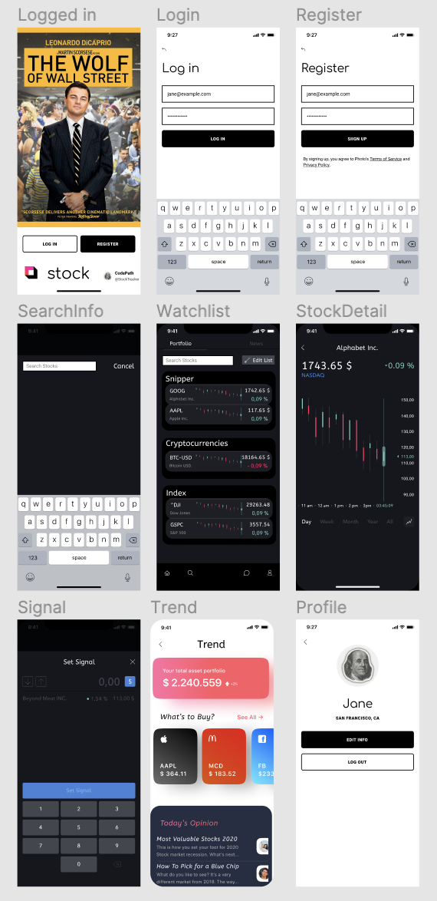

Group Milestone (Week 8, 9, 10, 11, 12)

## Week 12: Milestone Deliverables
- Updated status of issues in Project board (2pts) [ x ]

- Sprint planned for next week (Issues created, assigned & added to project board) (3pts) [ x ]

- Completed user stories checked-off in README (2pts)
   * User logs in to access previous watchlist and preference settings [ x ]
   * User picks what their interested stocks and customizes their own watchlist. [ x ]
   * User can read the detailed information of stocks, such as the price, earnings, and some quantitative metrics [ x ]
   * User can browse the popular stocks. [ x ]
   * User can read news [ x ]
   * Settings (Dark Mode, Logout, Info, etc.) [ x ]
- Gif created to show build progress and added to README (3pts) [ x ]

===
## Table of Contents
1. [Overview](#Overview)
1. [Product Spec](#Product-Spec)
1. [Wireframes](#Wireframes)
1. [Schema](#Schema)
## Overview
### Description
An app that will show the customized contents of the interested stocks and push signals to buy or sell stocks based on some investment strategies.

### App Evaluation
- **Category:** Tech Finance
- **Mobile:** It would allow users to be updated by stock prices without the hassle of getting on their phone
- **Story:** Send signals when some measurements are satisfied
- **Market:** Any individual investor could use this app to simplify their investment processing, they would create an account in order to trace stocks and receive recommendations for investments.
- **Habit:** Stock traders need constant updated information and investment suggestions on stocks.
- **Scope:** First we would collect the detailed information of stocks and then we would work on allowing the user to set up a watchlist. Next, we can design some strategies based on quantitative trading to help investment.

## Product Spec
### 1. User Stories (Required and Optional)

**Required Must-have Stories**

* User logs in to access previous watchlist and preference settings
* User picks what their interested stocks and customizes their own watchlist.
* User can read the detailed information of stocks, such as the price, earnings, and some quantitative metrics.
* User can browse the popular stocks.
* Profile pages for each user
* Settings (Accessibility, Notification, General, etc.)

**Optional Nice-to-have Stories**

* Design some strategies for quantitative trading
* Browse and add comments for each stock

### 2. Screen Archetypes
* Cover Screen
   * User can access to the Login or Register Page
* Login & Register Screen
   * User logs in to access previous watchlist and preference settings
* Watchlist Screen 
   * User picks what their interested stocks and customizes their own watchlist.
* Stock Search Screen 
   * User search what their interested stocks and add it to the selected watchlist.
* Stock Details Screen.
   * User can read the detailed information of stocks, such as the price, earnings, and some quantitative metrics.
* Trend Screen.
   * User can browse the popular stocks.
* Profile Screen
   * Profile pages for each user
   * Settings (Accessibility, Notification, General, etc.)   
* Signal Screen.
   * Design some strategies for quantitative trading.
* Comment Screen.
   * Browse and add comments for each stock

### 3. Navigation

**Tab Navigation** (Tab to Screen)

* Log Out
* Trend
* Profile

Optional:
* * Signal

**Flow Navigation** (Screen to Screen)
* Forced Log-in -> Account creation if no log in is available
* Watchlist Screen -> Stock Details Screen -> Comment Screen
* Watchlist Screen -> Stock Search Screen
* Profile -> Text field to be modified / Toggle settings

### [BONUS] Digital Wireframes & Mockups

### [BONUS] Interactive Prototype

## Schema 
### Models
#### User: Post
| Property      | Type     | Description |
   | ------------- | -------- | ------------|
   | account      | String   | unique id for the user post (default field) |
   | password     | String | verification|
   | avatar         | File     | avatar for users|
   | email   | String   | connection |
   | watchlist   | Object   | Added watchlist of stocks |
   
  
### Networking
#### List of network requests by screen
   - Watchlist Screen
      - (Read/GET) Query all stocks where user has requested
      - (Create/POST) Add stock to user's watchlist
      - (Delete) Delete existing stock in watchlist
   - Signal Screen
      - (Create/POST) Make push notification for stock at certain price
      - (Delete) Delete existing push notifications level
   - Profile Screen
      - (Read/GET) Query logged in user object
      - (Update/PUT) Update user profile avatar
      
#### [OPTIONAL:] Existing API Endpoints
##### An API Of Yahoo Finance
- [Unofficial Doc](https://observablehq.com/@stroked/yahoofinance)
- Base URL - [https://query1.finance.yahoo.com](https://query1.finance.yahoo.com)

   HTTP Verb | Endpoint | Description
   ----------|----------|------------
    `GET`    | /v10/finance/quoteSummary/MSFT?modules=defaultKeyStatistics | [get defaultKeyStatistics for MSFT](https://query1.finance.yahoo.com/v10/finance/quoteSummary/MSFT?modules=defaultKeyStatistics)
     `GET`    | /v8/finance/chart/MSFT?symbol=MSFT | [get history data for MSFT](https://query1.finance.yahoo.com/v8/finance/chart/MSFT?symbol=MSFT)
     `GET`    | /v7/finance/options/MSFT | [get option info for MSFT](https://query1.finance.yahoo.com/v7/finance/options/MSFT)

##### User Storage - Back4App
- Base URL - [Refer to the HW5 for CRUD of Back4App](https://courses.codepath.org/courses/ios_university/unit/5#!assignment)

   HTTP Verb | Endpoint | Description
   ----------|----------|------------
    `GET`    | X | X
    `POST`    | X | X
    `PUT`    | X | X
    `DELETE`    | X | X