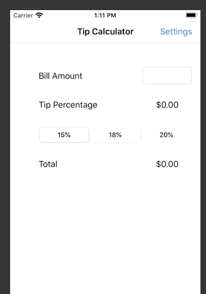

# ios_course

## Pre-work

- A tip calculator of multiple consumers for iOS.

- Submitted by: Chenning Li @ MSU

- Time consumption: **0.6** hours

### Functions

All required functionalities are completed:

* [X] Compute a bill amount with a chosen tip percentage.
* [X] Real time total tip updated as the first responder
* [X] Settings page for page switch.
* [X] Lifecycle for the page loading

The following **additional** features are implemented:

- [X] Users could select the number of people (up to a maximum of 10) to split or combine the bill
- [X] Multiple IBActions manipulated as the alphabetically order

### Demo Visualizatio

### Comments

Challenges encountered while building the app.

* The first time to use Swift and xCode, a challenging but very impressive user experience.

* Asynchronous actions do not complete in order, solved by referring to the official manual.

* Achieved all of things with a limited time.
